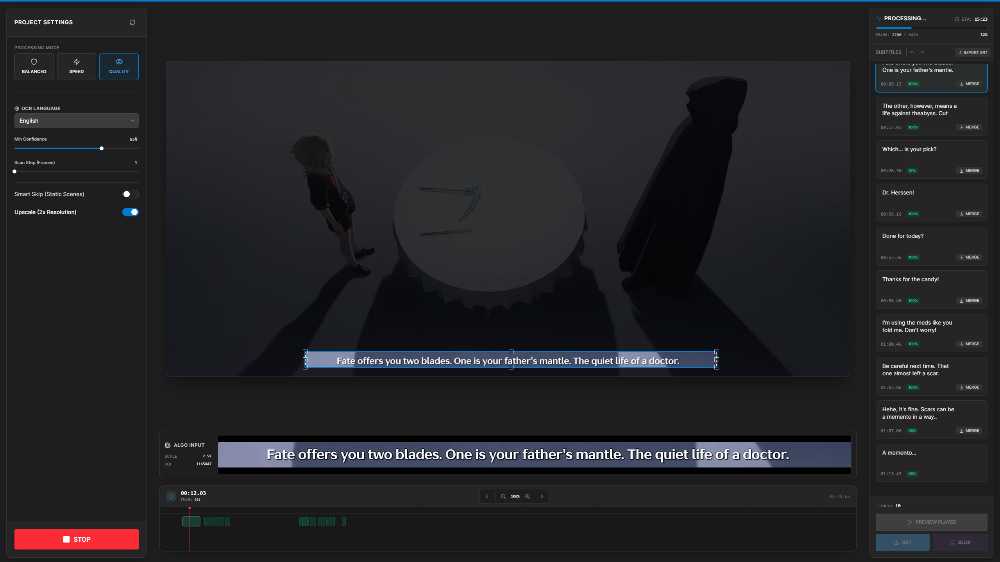
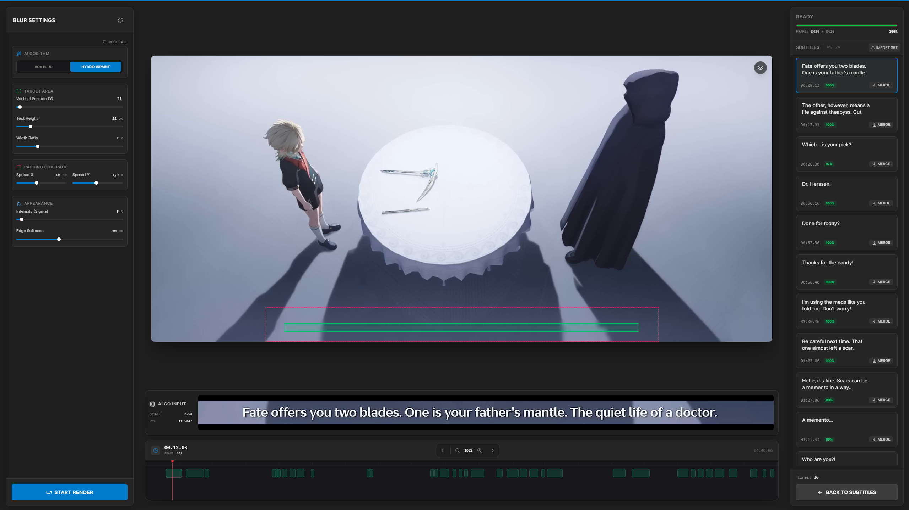

# SubVision

Automated hardsub detection, extraction, and smart blurring tool powered by **PaddleOCR** (GPU) and **OpenCV**. 

Built with a modern, cloud-native microservices architecture ensuring high performance, zero UI latency, and safe GPU memory management.



## ✨ Key Features
- **GPU Accelerated OCR:** Batched, CUDA-accelerated text detection and recognition using PaddlePaddle.
- **Smart Skip V5:** "Absolute Pixel Trigger" algorithm for precise, noise-resistant frame analysis, saving GPU compute time.
- **Cloud-Native Architecture:** 100% Stateless FastAPI backend decoupled from heavy ML tasks via **Redis** and **ARQ**.
- **Storage Agnostic:** Run completely offline using local Docker volumes, or switch to **AWS S3** for direct client-to-cloud multipart video uploads.
- **Zero-Latency UI:** In-browser frame extraction via HTML5 `<canvas>` and real-time WebSockets tracking via Redis Pub/Sub.

## 🏗 Architecture
The project is split into independent, horizontally scalable components:
1. **Frontend (React + Vite):** Handles S3 multipart uploads directly, decodes frames in-browser, and maintains timeline state.
2. **API (FastAPI + Nginx):** Lightweight, stateless router. Receives commands and enqueues jobs into the Message Broker.
3. **Message Broker (Redis):** Handles the ARQ task queue and acts as a Pub/Sub bus for real-time WebSocket events.
4. **Worker (ARQ + CUDA):** Heavy-duty isolated environment. Downloads media, executes PaddleOCR/OpenCV pipelines, guarantees strict `max_jobs=1` concurrency to prevent GPU Out-Of-Memory errors, and uploads results back to storage.



## 🚀 Quick Start (Docker)
*Prerequisites: Docker Desktop + NVIDIA Drivers + NVIDIA Container Toolkit.*

The entire stack (Nginx, API, Redis, and ML Worker) runs automatically via Docker Compose.

```bash
git clone https://github.com/Dezexus/SubVision.git
cd SubVision
docker-compose up --build
```
Open **[http://localhost:7860](http://localhost:7860)**.

## ⚙️ Manual Setup (Development)

For local development, you need to run the components independently.

### 1. Start Redis
You must have a Redis instance running locally:
```bash
docker run -p 6379:6379 -d redis:7-alpine
```

### 2. Start the API Server (Terminal 1)
```bash
cd backend
python -m venv venv && source venv/bin/activate
pip install -r requirements.txt
uvicorn main:app --reload --port 8000
```

### 3. Start the ML Worker (Terminal 2)
*Ensure you have CUDA installed on your host machine if running without Docker.*
```bash
cd backend
source venv/bin/activate
pip install -r requirements-worker.txt
python -m arq worker.WorkerSettings
```

### 4. Start the Frontend (Terminal 3)
```bash
cd frontend
npm install
npm run dev
```

## 🔧 Environment Configuration (`.env`)

You can configure the application by creating a `.env` file in the `backend` directory.

| Variable | Default | Description |
| :--- | :--- | :--- |
| `STORAGE_MODE` | `local` | Set to `s3` to enable direct AWS S3 multipart uploads. |
| `REDIS_URL` | `redis://redis:6379/0` | Connection string for the ARQ queue and Pub/Sub. |
| `S3_ENDPOINT` | `None` | Custom S3 endpoint (e.g., MinIO url). |
| `S3_BUCKET` | `subvision` | Target S3 bucket name. |
| `S3_ACCESS_KEY` | `minioadmin` | S3 Access Key. |
| `S3_SECRET_KEY` | `minioadmin` | S3 Secret Key. |

*Note: Adjust `FLAGS_fraction_of_gpu_memory_to_use` in `docker-compose.yml` (default `0.9`) to `0.4` or lower if you run multiple instances or have limited VRAM.*

## 📖 Usage Workflow
1. **Upload** a video (Drag & Drop).
2. **Crop** the target subtitle area (ROI) on the preview canvas.
3. Configure the OCR language and skip-threshold, then click **Start Processing**.
4. Review, edit, or merge the detected subtitles in the right panel.
5. Switch to **Blur Mode**, adjust bounding box padding, Sigma, and Feather.
6. Click **Start Render** and download the final obscured video.
